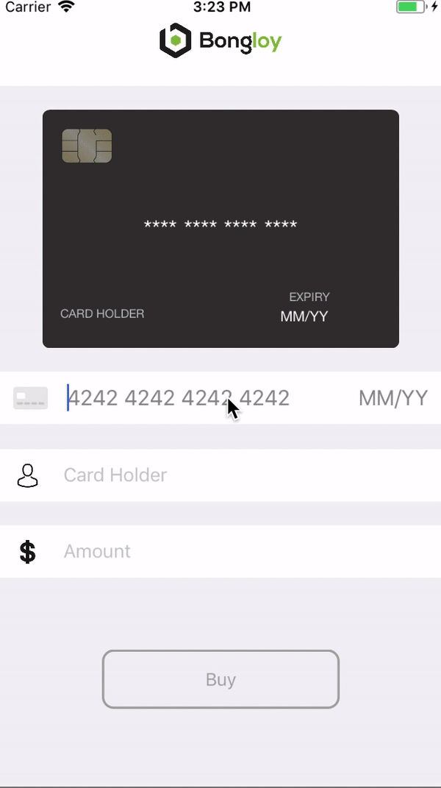

Bongloy-demo-ios is a iOS app which demonstrates how to use Bongloy.
### Screenshots


## Installation

    $ git clone https://github.com/khomsovon/bongloy-demo-ios.git
  ```sh
  cd bongloy-demo-ios
  ```
  ```sh
  pod install
  ```
  ```sh
  open bongloy-demo-ios.xcworkspace
  ```
  Fill in the `BONGLOY_PUBLISHABLE_KEY` and `BACKEND_BASE_URL` constant in ./bongloy-demo-ios/Utilities/Constants.swift
```swift
let BACKEND_BASE_URL = "Your backend base url"
let BONGLOY_PUBLISHABLE_KEY = "sk_test_****************************************************************"
```
`BONGLOY_PUBLISHABLE_KEY` Find it [here](https://sandbox.bongloy.com/dashboard/account_details)
and Bongloy demo backend [here](https://github.com/bongloy/bongloy-demo-laravel)

## Official Documentation

Documentation for Bongloy can be found on the [Bongloy website](https://www.bongloy.com/documentation).
